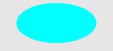
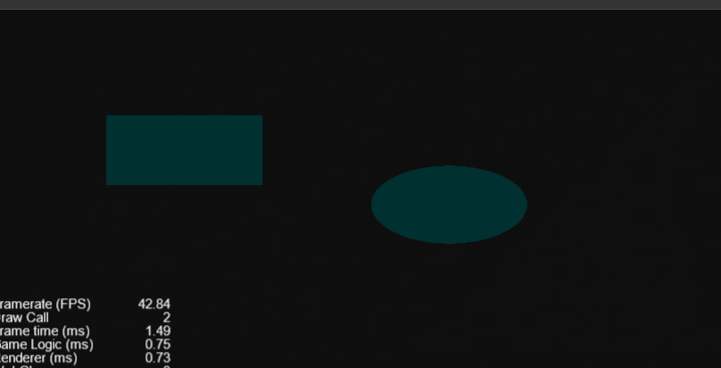

# SDF

1. SDF 有限距离场（用来描述物体的隐式模型）通过一个有符号的数字来表示到物体表面的距离在物体内的点，距离小于零。在物体外的点，距离大于零。

### 圆



1. 在图片分辩率为1:1的情况下，只需简单判断渲染点与圆心的坐标差值即可

2. 如果不是1：1 则需要乘上上一个长宽比。

3. 代码如下：

   ```c
    // 圆
     float sdf_circle( vec2 render_v2_,  float radius_f_) {
       return length(render_v2_) - radius_f_;
     }
   ```

### 软阴影

 原理： 从渲染点出发到光源点，依次步进安全距离（SDF距离场，代表这个范围不会触碰到物体），如果距离场 < -hard_f_ 则返回 0，同时在-hard_f_ 到 0 的范围内对阴影进行平滑过渡，这样软阴影就可以过渡到硬阴影的范围内，看起来更真实！ 

具体实现：

1. 拿到渲染点到光源的单位向量。

2. 渲染点坐标 + 单位向量 * 步长（每次前进的距离），就得到一个新的点。判断这个点是否在物体内，如果在则直接返回 0。

3. 如果不在每次递增步长

4. 如果步长大于渲染点到光源的距离，则返回一个跟亮度值（这个值跟到光源的距离呈正相关）

5. 代码如下：

6. ```c
   // 软阴影
   	float shadow(vec2 render_v2_, vec2 light_v2_, float hard_f_) {
   		// 当前渲染位置到光源位置的方向向量
   		vec2 render_to_light_dir_v2 = normalize(light_v2_ - render_v2_);
   		// 渲染位置至光源位置距离
   		float render_to_light_dist_f = length(render_v2_ - light_v2_);
   		// 可见光的一部分，从一个半径开始（最后添加下半部分）；
   		float brightness_f = hard_f_ * render_to_light_dist_f * 10.0;
   		// 行走距离
   		float travel_dist_f = 0.001;
   
   		for (int k_i = 0; k_i < 20; ++k_i) {				
   		// 当前位置到场景的距离
   			float dist_f = scene_dist(render_v2_ + render_to_light_dir_v2 * travel_dist_f);
   
   			// 渲染点在物体内部
   			if (dist_f < -hard_f_) {
   				return 0.0;
   			}
   			 
   			// dist_f 不变，brightness_f 越小，在越靠近光源和物体时 brightness_f 越小
   			brightness_f = min(brightness_f, dist_f / travel_dist_f);
   
   			// max 避免渲染点距离物理表面过近导致极小耗尽遍历次数，所以有可能会跳过物体距离小于1.0的阴影绘制
   			// abs 避免朝回走
   			travel_dist_f += max(0.001, abs(dist_f) );
   
   			// 渲染点的距离超过光源点
   			if (travel_dist_f > render_to_light_dist_f) {
   				break;
   			}
   		}
   
   		// brightness_f * render_to_light_dist_f 根据距离平滑, 离光源越近越小，消除波纹线
   		// 放大阴影，hard_f 越大结果越小则阴影越大, hard_f_ / (2.0 * hard_f_) 使结果趋近于0.5，用于平滑过渡
   		brightness_f = clamp((brightness_f * render_to_light_dist_f + hard_f_) / (2.0 * hard_f_), 0.0, 1.0);
   		brightness_f = smoothstep(0.0, 1.0, brightness_f);
   		return brightness_f;
   	}
   ```

   