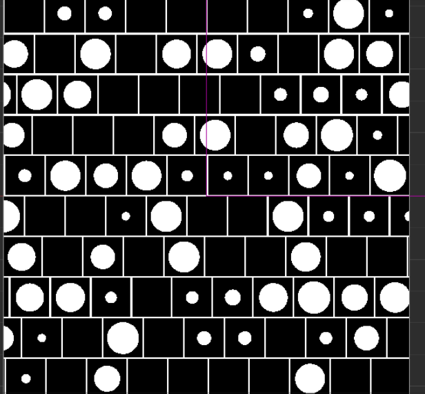

### glsl常用api

1. mix(x,y,a) a控制混合结果 return x(1-a) +y*a 返回线性混合的值 
2. smoothstep (x y a )

   1. 参数  y必须大于x 
   2.  a < x 返回 0 
   3. a > y 返回 1 
   4. 在x y之间 返回 3a^2-2a^3
3. step (x a)

   1.  如果a小于x就是0 
   2.  否则 返回1 
4. fract(x) 返回x-floor(x)，即返回x的小数部分 
5. clamp（a,b,c) 返回中间的数
6. 随机数函数实现 https://thebookofshaders.com/10/?lan=ch

### 溶解shader


1. 主要原理就是取一张噪声图，然后取一个dissolveValue（自己定义），之后根据uv坐标，去拿到噪声图上的rgb，再然后判断其的值是否大于溶解值，如果小于就不进行处理（图片显示为透明），但是这样会显的过于僵硬。于是选取一个临界值范围，将大于dissolveValue，小于dissovleValue + 临界值的像素渲染为橙色。已达到一个过渡效果。

   ```c
   
       vec4 dissolveMap = texture(u_dissolveMap, v_uv0);
       value *= dissolveMap.b;
       CCTexture(texture, v_uv0, o);
       o *= v_color;
       if(value < dissolveValue ){
         discard;
       }
       if(value < dissolveValue + 0.08){
         o = vec4(0.9,0.6,0.3,o.a); // 橙色
       }
   ```

### 边缘发光shader


1. 这个shader最大的难点就是如何判断这个像素是否是边缘点

   1. 边缘的点的周边像素一定是透明的

   2. 因此我们可以采样周边像素Alpha取平均值

      1. 采样像素点的圆边上的所有点的平均值

      2. 再采样圆周边的像素alpha 的平均值

      3. ```c
         float getColorAlpha(float angle, float dist) {
             // 角度转弧度，公式为：弧度 = 角度 * (pi / 180)
             float radian = radians(angle);
             vec4 color = texture(texture, v_uv0 + vec2(dist * cos(radian), dist * 				sin(radian))); 
             return color.a;
           }
         float getAverageAlpha(float dist) {
             float totalAlpha = 0.0;
             // 以30度为一个单位
             totalAlpha += getColorAlpha(0.0, dist);
           	...
             totalAlpha += getColorAlpha(330.0, dist);
             return totalAlpha * 0.0833; // 1/ 12
           }
         ```

         

2. 调试发光
   1. 定义一个 发光颜色

   2. 定义发光阀值（当alpha小于多少时就不进行采样）

   3. rgb值进行混合叠加

   4. ```c
      	float alpha = getGlowAlpha();
          if (alpha > glowThreshold) {
            // 内发光是从边缘发光的，是需要内部透明度为0，靠近边缘的接近1的透明度
            // 因此我们需要反转一下透明度
            alpha = 1.0 - alpha * alpha * alpha;
          }
          vec4 color_src = o;
          vec4 color_dest = glowColor * alpha;
          // 在图案上方，叠加一个内发光
          gl_FragColor = color_src  + color_dest;
      ```

      

### 闪光shader

​	

1. 在图片中取一个矩形，进行高亮，然后不停的移动这个高亮区域。

   1. ```c
      vec4 tex = texture(texture, v_uv0);
            float start = startPos * 1.2;
            float strength = 2.0;
            float offset = 0.2;
      if( v_uv0.x < (start - offset * v_uv0.y + width) &&  v_uv0.x > (start - offset * v_uv0.y))
       {
           vec3 improve = strength * vec3(1, 1, 1);
           vec3 result = improve * vec3( o.r, o.g, o.b);
           gl_FragColor = vec4(result, o.a);
        } 
      ```

      

### 追光shader


1. 获取鼠标的位置，对鼠标周围的区域进行采样，alpha值设为0。

2. 对采样的边缘位置，进行一个过渡。

   1. ```c
      o *= texture(texture, v_uv0);
          o *= v_color;
          float rate = 2.0;
          float radius = circleRadius * circleRadius;
          float disX = (v_uv0.x - pos.x) * rate;
          float disY = (v_uv0.y  - pos.y);
          float dis = disX * disX + disY * disY;
         
          o.a = smoothstep(radius - 0.02, radius, dis - radius);
      
      ```

### 水面shader


1. 水面

   1. 思路为获取噪声图图上的rgb值，在对原图进行渲染的时候加上噪声的扰动。

   2. 为了让水面动起来，在对噪声图采样时，可以加入时间的参数。

   3. ```c
      vec2 tempUv = v_uv0;
      CCTexture(noiseMap, v_uv0 + v_time.x * speed, noiseC);   
      tempUv.x += noiseC.x / (20.0 - strength);
      CCTexture(texture, tempUv, o);
      ```

      

2. 倒影

   1. 建立一个相机，让相机的看向我们需要倒影的物体

   2. 将相机里的数据写入texture。

   3. 将texture作为水面

   4. ```ts
      this.width = 200;
      this.height = 80;
      this.tex.initWithSize( this.width,this.height)
      this.camera.targetTexture = this.tex;
      
      this.camera.orthoSize = this.height  / 2;
      let spriteFrame = new cc.SpriteFrame();
      spriteFrame.setTexture(this.tex);
      this.node.getComponent(cc.Sprite).spriteFrame = spriteFrame
      ```

   

   

### 2d 阴影

   

1. 原理有点像 布林-冯模型 （到达像素的能量 = 环境光 + 漫反射 + 高光）

   1. 2d阴影里少了一个高光。

   2. 环境光 （自己定义一个）

   3. 漫反射 = 光线方向 和 法线的点乘 。 再去乘以 光源的能量 / 光源到像素点的距离的平方。

   4. 因此该shader需要用到法线图。（法线图大小为 【-1,1】,而普通材质图只能表示【0,1】,因此需要将rgb值 * 2 -1）

   5. ```c
      
          CCTexture(texture, v_uv0, o);
          normalO =texture2D(normalTex, v_uv0).rgb;
          normalO = normalO * 2.0 - 1.0;
          normalO.y = -normalO.y;
          if(kBump != 1.0){
              normalO.z = normalO.z / kBump;
              normalO = normalize(normalO);
          }
          vec4 curPixelPos = vec4(v_uv0.x * contentSize.x , (1.0 -v_uv0.y) * contentSize.y, 0.0, 1.0);
          vec4 lightDir = normalize(curPixelPos - lightPos);
          float len = distance(curPixelPos , lightPos);
      
          vec4 arrLight = lightColor * 100.0  / len ;
          vec3 dir = -lightDir.xyz;
          float energy = max(0.0 , dot(normalO,dir));
          vec4 diffuse = vec4(energy * vec3(arrLight),1.0);
          o *= v_color;
          gl_FragColor =  o * vec4(vec3(diffuse)+ ambientLight.xyz ,1.0) ;
      ```

      

   

### 水面涟漪


1. 获取鼠标的位置，将其转换为uv坐标

2. 根据时间和速度来计算，当前水波应该到达的位置

3. 用正弦函数来模拟水的波纹

4. ```c
   vec2 uv = v_uv0;
   if(centerPos.w != 0.0){
   	vec2 uvDir = normalize(v_uv0 - vec2(centerPos));
   	float dis = distance(v_uv0, vec2(centerPos));
   	float disRange = (v_time.x   - centerPos.z) * u_speed;
   	if(dis < disRange + u_range && dis > disRange - u_range){
    	uv = v_uv0 + u_waveStrength * uvDir * sin(dis * u_waveFactor);
   	}
   }
   
   ```

   

### 马赛克


1. 将图片分为m块

2. 计算像素点所在方块

3. 取该方块内的中心点，代表该方块的颜色、

4. ```c
   vec2 getPos(){
       float mNum = 1.0;
       if(num > 0.0){
         mNum = num;
       }
       float len = 1.0 / mNum ;
       float xIndex = floor(v_uv0.x / len);
       float yIndex = floor(v_uv0.y / len);
       return vec2(len * (xIndex + 0.5),len * (yIndex + 0.5) );
     }
   ```

   

### 高斯模糊


1. 选定一个标准差，对于大于3个标准差之外的点不进行计算

2. 套用高斯函数，计算出所有的高斯矩阵上的和

3. 计算每个像素的权重，之后进行累加。

4. ```c
   
       float totalWeight = getWeight(0.0, 0.0);
       for(float x = 1.0; x <= halfSize; x++) {
           totalWeight += getWeight(x, 0.0) * 2.0;
       }
       for(float y = 1.0; y <= halfSize; y++) {
           totalWeight += getWeight(0.0, y) * 2.0;
       } 
       for(float x = 1.0; x <= halfSize; x++) {
         for (float y = 1.0; y<= halfSize; y++) {
           totalWeight += getWeight(x, y) * 4.0;
         }
       }
       vec4 finalColor = vec4(0.0, 0.0, 0.0, 0.0);
       float onePxWidth = 1.0 / texSize.x;
       float onePxHeight = 1.0 / texSize.y;
       for(float x = -halfSize; x<= halfSize; x++) {
         for (float y = -halfSize; y<= halfSize; y++) {
           float weight = getWeight(x, y) / totalWeight;
           finalColor += texture(texture, v_uv0 + vec2(onePxWidth * x, onePxHeight * y)) * weight;
         }
       }
        gl_FragColor = finalColor;
   ```

   

### 霓虹shader


1. 首先这个霓虹由4部分组成，背景 + 3层圆圈
2. 圆圈实现：
   1. 将图片划分成不同的方格
   2. 将uv坐标 * 10（一个倍数），然后再取整。等到的就是方格的索引。
   3. 在方格内部取圆（根据距离判断就好）
   4. 取圆的时候，对圆的半径取随机数
   5. 
   6. 随机去掉2/3的圆，并对uv坐标也进行一个随机偏移。
   7. 
   8. 最后对颜色的亮度也进行一个随机。
   9. 重复以上步骤3次，然后加上背景色。

### 波浪shader


1. 使用正弦函数来表示波浪

2. 

   1.  A：**振幅（Amplitude）**，影响曲线最高点与最低点的差值
   2.  ω：**角速度（Angular Velocity）**，控制曲线的周期，影响曲线的紧密程度
   3.  φ：**初相（Initial Phase）**，即当 `x = 0` 时的相位，表现为曲线在坐标系上的水平位置
   4.  k：**偏移（Offset）**，表现为曲线在坐标系上的垂直位置

3. 通过控制k的数值就可以来控制波浪上下移动

4. ```c
   o *= v_color;
       float initiaPhase = frequency * v_time.x;
       float direction = toLeft ? 1.0 : -1.0;
       float y = amplitude * sin((angularVelocity * v_uv0.x) + ((frequency * v_time.x) * (toLeft ? 1. : -1.))) + (1.0 -offset);
       if(v_uv0.y < y) discard;
   ```

   


