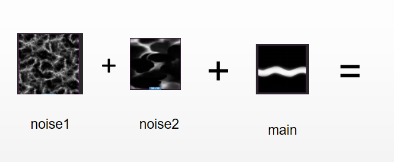

### 尾焰


其实主要的思想就一个，拿两张噪声图以及一张遮罩图去影响主图的流动。

细节部分

1. 在实现过程中，我是使用两张噪声图分别影响主图的uv坐标。同时让他们以不同的流速动起来，就会得到这样一张图片。

   1

2. 为了控制尾部的长度，我们可以使用一张遮罩图去影响noise1的uv坐标，就会得到这样一张图。

    

3. 最后将他们叠加起来。并为头部和尾部加上颜色。就可以得到颜色的效果。

代码如下：

```c
 // 噪声图也进行移动
    float tempX = v_time.x * u_flowStrength * -1.0 + v_uv0.x;
    tempX = mod(tempX,1.0);
    vec2 tempUv = vec2(tempX ,v_uv0.y);
    CCTexture(u_noiseMapX,tempUv,noiseR);
    CCTexture(u_noiseMapY,tempUv,noiseYO);
    vec4 noise = noiseR + noiseYO;
    //noise = noise * 2.0 - 1.0;
    #if USE_TEXTURE
      // 主像素
      tempX = v_time.x * u_speed *  -1.0  + v_uv0.x + noiseR.r  / 10.0;
      tempX = mod(tempX,1.0);
      float tempY = v_uv0.y  + noiseYO.r  * v_uv0.x / 1.5;
      tempY = mod(tempY,1.0);
      tempUv = vec2(tempX,tempY);
      CCTexture(u_mainMap, tempUv , o);
    #endif

    
   // 控制长度
    vec4 maskRgb = vec4(1,1,1,1);
    float temX = v_uv0.x + (1.0 - 2.0 * u_length) ; 
    maskRgb = texture2D(u_mask,vec2(temX,v_uv0.y));
    maskRgb.r = 1.0 - 2.0 * maskRgb.r;
    noiseR += maskRgb.r;  
    
    o = noiseR;
  // 添加颜色
    vec4 resRgb = u_startColor * (1.0 - u_weight) * (1.0 - v_uv0.x) + u_endColor * u_weight * v_uv0.x;
    o =  o * resRgb * u_emission * noiseR;
    o.a = o.r;
```


### fireFrame


1. 其实可以把上面的图拆分成四部分，它由四条激光组成。

2. 首先我们要把像素点缩小成一根线，可以将uv上的y坐标减去0.5，然后 * 5 。最后uv坐标就会只剩下 0 - 0.1 之间。近似于一根线

3. 根据公式计算出波浪的噪声

4. 将噪声与y轴联系起来，使得它离中心点越远，rgb的值就越小

5. 最后做一个线性过渡

6. 代码如下
   ```c
   float t = v_time.x;
       vec2 uv = v_uv0;
       // 让x轴上下两部分以不同的速度动起来
       uv.x += uv.y < .5 ? 23.0 + t * .35 : -11.0 + t * .3; 
       // 将y轴范围缩小到 0 - 0.5   
       uv.y = abs(uv.y - .5);
       // 在将范围缩小到 0 - 0.1
       // 形成了一根线
       uv *= 5.0;
       
       float q = fire(uv - t * .013) / 2.0;
       // 拿到火焰的噪声纹理
       float f = fire(uv + q - t);
       vec3 color = vec3(1.0 , 1.0 , 1.0);
       // 火焰的宽度与y轴成正相关
       float grad = pow((f + f) * max(.0, uv.y) + .1, 4.0);
       // 让火焰有个渐变的过程
       color = ramp(grad);
       //color = vec3(1. - grad * 1.4, .4, 1.0) / grad;
       color /= (1.50 + max(vec3(0), color));
   
       gl_FragColor = vec4(color, 1.0);
   ```

   

### SDF

1. SDF 有限距离场（用来描述物体的隐式模型）通过一个有符号的数字来表示到物体表面的距离在物体内的点，距离小于零。在物体外的点，距离大于零。

2. 圆

   1. 

   2. 在图片分辩率为1:1的情况下，只需简单判断渲染点与圆心的坐标差值即可

   3. 如果不是1：1 则需要乘上上一个长宽比。

   4. 代码如下：

      1. ```c
          // 圆
           float sdf_circle( vec2 render_v2_,  float radius_f_) {
             return length(render_v2_) - radius_f_;
           }
         ```


### 在lua中实现表

1. ```lua
   function class(classname, super)
    local superType = type(super)
    local cls
   	
    --如果super 不是function 也不是table,就当他为空
    if superType ~= "function" and superType ~= "table" then
        superType = nil
        super = nil
    end
   	--如果是function 或者是一个c++ 对象 。 _ctype 1 代表c++对象，2 代表lua对象
    if superType == "function" or (super and super.__ctype == 1) then
        -- inherited from native C++ Object
        cls = {}
   		-- 如果他是一个表，将父类的属性存入类中
        if superType == "table" then
            -- copy fields from super（从super里继承属性）
            for k,v in pairs(super) do cls[k] = v end
            cls.__create = super.__create
            cls.super    = super
        -- 如果他是个函数
        else
            cls.__create = super
            cls.ctor = function() end
        end
   
        cls.__cname = classname
        cls.__ctype = 1
   		-- 添加new 函数（调用父类构造函数_create，以及自身构造函数ctor,然后将数据存入对象）
        function cls.new(...)
            local instance = cls.__create(...)
            -- copy fields from class to native object
            for k,v in pairs(cls) do instance[k] = v end
            instance.class = cls
            instance:ctor(...)
            return instance
        end
   
    else
        -- inherited from Lua Object
        -- 如果继承自lua对象，将super设为类的元表
        if super then
            cls = {}
            setmetatable(cls, {__index = super})
            cls.super = super
        else
           --如果没有super，就只添加一个空的构造函数
            cls = {ctor = function() end}
        end
   
        cls.__cname = classname
        cls.__ctype = 2 -- lua
        cls.__index = cls
        
        function cls.new(...)
         local instance = setmetatable({}, cls)
            instance.class = cls
            instance:ctor(...)
            return instance
        end
    end
   
    return cls
   end
   ```

   