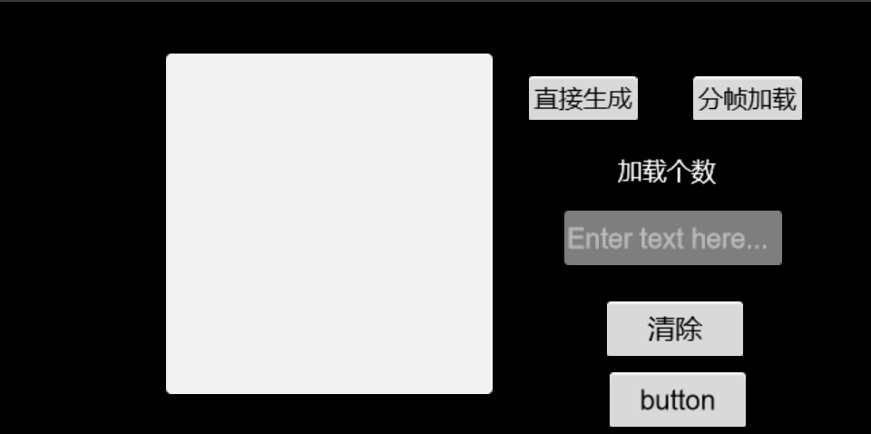

## 分帧加载 和 寻路

### 分帧加载



1. 如果直接在一帧里加载多个物体会有一个明显的卡顿

2. 这是因为JS是单线程的，也就意味着所有任务需要排队，只有当前一个任务结束了，后一个任务才会执行。如果前一个任务耗时很长，后一个任务就不得不一直等着。 可以使用协程来实现分帧加载，使得画面有个良好的过渡效果。

3. 主要原理就是利用 Ts的Generator（ 一种异步编程解决方案 ） 将一次 for 循环里创建所有节点，改为拆分 for 循环的每一步为一个小段，对每个小段进行一个时间限制比如100ms，当超出时间限制时就进入下一帧，使得一帧只加载for循环里的一部分，而不是全部。

4. ```ts
   private executePreFrame(generator: Generator, duration: number) {
           return new Promise((resolve, reject) => {
               let gen = generator; // 生成物体的函数
               let execute = () => {
                   // 执行之前，先记录开始时间戳
                   let startTime = new Date().getTime();
                   for (let iter = gen.next(); ; iter = gen.next()) {
                       // 判断是否已经执行完所有 Generator 的小代码段
                       // 如果是的话，那么就表示任务完成
                       if (iter == null || iter.done) {
                           resolve(1);
                           return;
                       }
                       // 每执行完一段小代码段，都检查一下是否
                       // 已经超过我们分配给本帧，这些小代码端的最大可执行时间
                       if (new Date().getTime() - startTime > duration) {
                           // 如果超过了，那么本帧就不在执行，开定时器，让下一帧再执行
                           this.scheduleOnce(() => {
                               execute();
                           });
                           return;
                       }
                   }
               };
               // 运行执行函数
               execute();
           });
       }
   ```

   

### 战争迷雾和寻路

1. 战争迷雾

   1. 将已经经过的点的信息写入到2d材质里，将材质与地图进行混合叠加，就可以实现战争迷雾。（cocos里的texture数据要求为Uint8Array，其大小为长 * 宽 * 4）

      1. ```ts
         onTouchMove(event: cc.Touch) {
                 let posX = event.getLocationX();
                 let posY = event.getLocationY();
                 posX =Math.floor(posX / 640 * this.width) ;
                 posY = Math.floor((320 - posY) / 320 * this.height);
                 
                 let index = posY * (this.width * 4) + posX * 4 + 3;
                 this.tex[index] = 0;
                 this.updatePic()
           }
         ```

      2. ```ts
         updatePic(){
          	this.texture= new cc.Texture2D();      			this.texture.initWithData(this.tex,cc.Texture2D.PixelFormat.RGBA8888,this.width ,this.height);
              let t = new cc.SpriteFrame(this.texture)
              this.node.getComponent(cc.Sprite).spriteFrame = t;
             }
         ```

   2. 寻路，使用的是A*算法。

      1. 首先将物体的节点（**起始点**）加入到**开列表**中
      2. 从开列表中取出花费值最小的节点（等会会讲到如何求花费值）（当前开列表中就一个节点）作为**当前点**
      3. 将**当前点**加入到**闭列表**中（已经用过的点，也是最后所需的点）
      4. 遍历**当前点周围的点**，搜索能通过的点(不是障碍物以及不在闭列表中)加入到开列表中，将它们的父节点设为当前点（如下图，箭头所指方向即为其父节点） 

      5. 当遍历**当前点周围的点**时遇到了终点，即完成了寻路。
      6. 从闭列表中最后一个点，向前遍历**父节点**，即为一条完整的路径 

   3. 花费值计算

      1.   F = G + H G = 从起点 A 移动到指定方格的移动代价，沿着到达该方格而生成的路径。 H = 从指定的方格移动到终点 B 的估算成本。（可以根据自己的要求去计算，这里选择最简单的方法，H = （终点与起点坐标的x轴的差值+终点与起点坐标的y轴的差值））如下图有红点的节点  

   4. 问题

      1.  当我们遍历当前点周围的点时会遇到一个问题“如果周围的点已经在开列表中怎么办?”
          这时我们要重新以当前节点到那个节点的G值，如果小于在开列表里的值则将那个节点的父节点设为当前点并重新计算F值。 