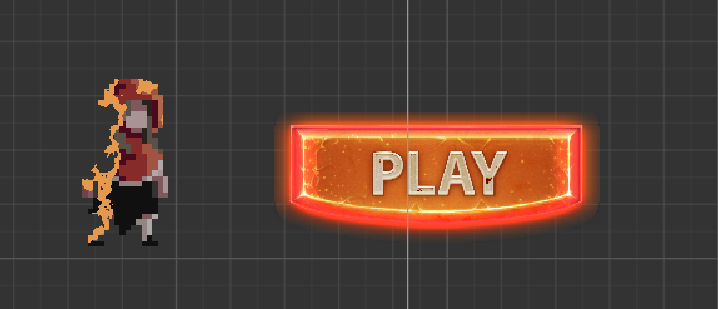

uniform 全局变量

attribute 属性和缓冲（应用程序传输给vertexShader的逐顶点数据）

varying 可变量（vertexShader 传输给fargementShader的插值数据）

in 值传递

inout 引用传递

out 函数结束后其值会被改变

### 溶解shader

1. 其实原理很简单，就是取一张噪声图，然后取一个溶解值（自己定义），再然后判断在噪声图上取到的点的rgb值是否大于溶解值，如果大于就不进行渲染。以及将在临界值附近的rgb值设为橙色（随你喜欢，以达到一个溶解效果）

### 发光shader

1. 采样周边像素Alpha取平均值
   1. 采样圆边上某点的 Alpha 值，并求边上的所有点的平均值
   2. 再采样圆周边的像素alpha 的平均值
2. 调试发光
   1.  定义一个 发光颜色
   2. 定义发光阀值（当alpha小于多少时就不进行采样）
   3. rgb值进行混合叠加